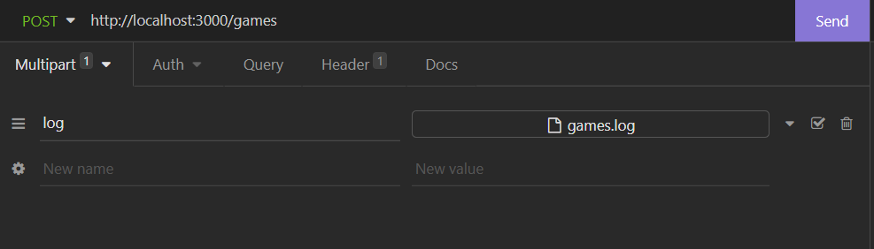
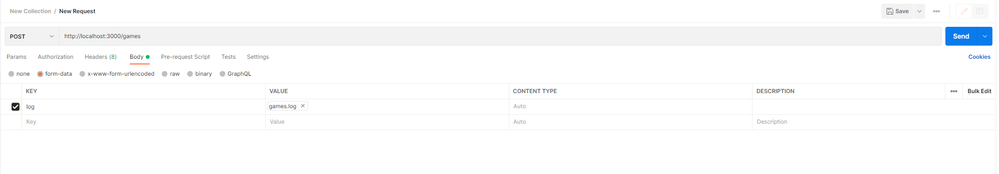
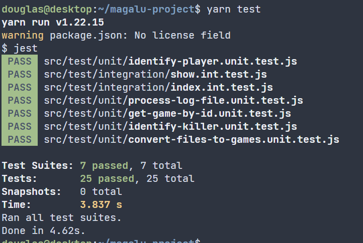

# LuizaLabs Challenge - Quake 3 Log Parser

## 💻 Sobre o projeto

A ideia deste projeto é construir um parser para logs do jogo Quake 3. A aplicação deve ser capaz de receber um arquivo .log contendo informações de partidas e disponibilizá-las em uma API REST.

Neste projeto, acabei me empolgando um pouco (🤦‍♂️) então foram feitos alguns incrementos. Sendo estes:

- Ao invés da aplicação ler um arquivo estático de logs, o usuário pode fornecer inúmeros arquivos de .logs para a aplicação. Isto se dará por meio de uma rota específica para receber um arquivo de logs, processá-lo e armazenar os jogos contidos nele.
- Uma vez que o usuário pode adicionar arquivos de forma dinâmica, pensei que seria interessante uma forma de manter os jogos anteriormente adicionados salvos de alguma forma. Por isso, subi um serviço de banco de dados mongo e conectei a aplicação. Desta forma, quando um usuário envia um arquivo para processamento, este será armazenado no mongo e as consultas seguintes serão feitas olhando para esta base de dados.

## 🌎 Rotas da aplicação

Primeiramente, a aplicação possui 3 rotas, sendo elas:

- **[GET] /games**: Responsável por disponibilizar todos os jogos processados e salvos no banco de dados.
- **[GET] /games/:id**: Responsável por consultar um jogo específico armazenado na base de dados. Para isso, é necessário informar o _id do respectivo jogo como parâmetro da rota. (é possível visualizar tal informação por meio de uma UI para bases de dados mongo (como o Robo3T) ou fazendo uma consulta GET para /games, que retornará todos os jogos com seus respectivos _ids).
- **[POST] /games**: Resposável por enviar o arquivo de logs para que a aplicação o processe e salve os jogos na base de dados. Os arquivos devem ser enviados por meio de um form-data com o nome “log”, conforme segue na imagem:
    
    
    
    Requisição feita no Insomnia
    
    
    
    Requisição feita no Postman
    

## 🧪 Rodando os testes

Os testes da aplicação foram desenvolvidos utilizando a biblioteca Jest. Para executá-los, basta digitar o seguinte comando:

```bash
yarn test
```


Certifique-se que o sua base de dados de teste esteja totalmente funcional. Os passos para configurá-la serão mostrados a seguir.

## 🚀 Fazendo deploy da aplicação

Para fazer deploy da aplicação, você vai precisar de duas ferramentas, o Docker e o Docker-compose. 

Caso não possua as ferramentas:

- Instalação do Docker: [https://docs.docker.com/engine/install/ubuntu/](https://docs.docker.com/engine/install/ubuntu/)
- Instalação do Docker-compose: [https://docs.docker.com/compose/install/](https://docs.docker.com/compose/install/)

Optei por usar estas ferramentas pois, como acabei utilizando um banco de dados Mongo, achei que seria mais comodo subir todo o ambiente da aplicação se ele estivesse encapsulado em containers docker.

Tendo as ferramentas instaladas, basta rodar o seguinte comando  na raiz do projeto:

```bash
docker-compose up -d
```

Caso não possua as ferramentas docker ou não queira instalar, é possível realizar do deploy de forma manual.

Para isso, primeiro, precisamos criar o serviço de banco de dados e criar dois bancos. 

- Instalação do Mongo em Windows: [https://www.mongodb.com/docs/manual/tutorial/install-mongodb-on-windows/](https://www.mongodb.com/docs/manual/tutorial/install-mongodb-on-windows/)
- Instalação do Mongo em Linux: [https://www.mongodb.com/docs/manual/administration/install-on-linux/](https://www.mongodb.com/docs/manual/administration/install-on-linux/)

Após a instalação, é necessário criar duas bases, uma chamada quake3 e outra chamada test-quake3. Em seguida, crie uma collection chamada “games” em cada uma das bases. 

Por fim, você deve configurar a API. Primeiramente, vamos instalar as dependências do projeto. Para isso, foi utilizado o package manager Yarn. Caso você não o tenha instalado, [clique aqui](https://classic.yarnpkg.com/lang/en/docs/install/#windows-stable) para mais detalhes de como instalá-lo.

Rode o seguinte comando para instalar as dependências do projeto:

```bash
yarn
```

Por fim, rode o seguinte comando para iniciar o servidor da API:

```bash
yarn start
```

Como podemos ver, são diversos passos, de modo que utilizar o docker para realizar deploy da aplicação é muito mais vantajoso e prático.

## 🚩 Pontos de melhorias

Infelizmente, nem todos os aspectos do projeto ficaram da forma como eu gostaria. Portanto, temos alguns pontos que podem ser melhorados, sendo eles:

- **Testes integrados que utilizam a API:** durante meus testes, consegui implementar testes automatizados que utilizam um servidor local. Até então, estavam rodando corretamente como mostra a imagem. Porém, testando em outra máquina, alguns testes que utilizam a API não rodaram corretamente pois foram encontrados erros de portas já sendo utilizadas. Possívelmente, ao tentar executar os testes em sua máquina, você verá tais erros, portanto, este é um ponto que poderia ser melhorado no projeto.
    
    Portanto, acabei removendo os testes de integração, visto que boa parte destes não passavam por conta do motivo citado (precisei remover os arquivos pois o Jest me obriga a especificar ao menos um teste em arquivos .test.js).
    
    
    

- **Teste de integração para salvar os jogos:** tive problemas ao implementar os testes de integração relacionados a rota responsável por salvar os games. A forma como havia este havia sido implementado não estava fazendo com que o arquivo chegasse ao servidor. O teste conseguia chegar até a API mas a mensagem de erro “File with the games was not provided.” era retornada, informando que nenhum arquivo havia sido passado. Portanto, os pontos de melhoria resumem-se principalmente a testes de integração da aplicação.

Foi extremamente divertido construir essa aplicação (tanto que acabei me empolgando um pouco hahaha). Deixo aqui ao Luizalabs meu muito obrigado pela oportunidade e meus parabéns pela proposta de desafio, super massa 😆